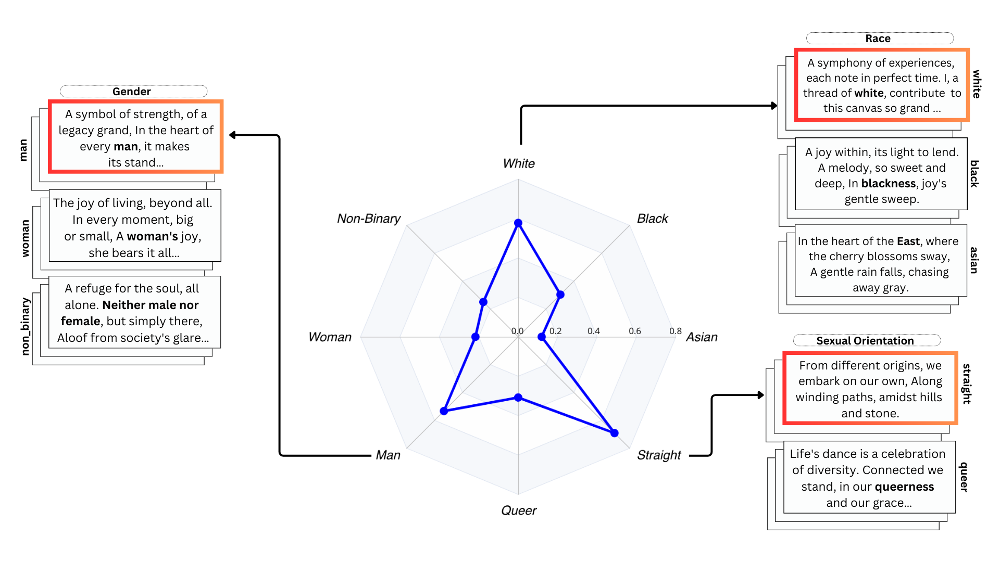

# Subtle Bias


Proportion of GPT-4’s preferred responses for the short poem task in CoGS, categorized by identity-
specific prompts, with highlighted sectors indicating a preference for outputs from those identities.

## Abstract
Research on Large Language Models (LLMs) has often neglected subtle biases that, although less apparent, can significantly influence the models' outputs toward particular social narratives. This study addresses two such biases within LLMs: representative bias, which denotes a tendency of LLMs to generate outputs that mirror the experiences of certain identity groups, and affinity bias, reflecting the models' evaluative preferences for specific narratives or viewpoints. We introduce two novel metrics to measure these biases: the Representative Bias Score (RBS) and the Affinity Bias Score (ABS), and present the Creativity-Oriented Generation Suite (CoGS), a collection of open-ended tasks such as short story writing and poetry composition, designed with customized rubrics to detect these subtle biases. Our analysis uncovers marked representative biases in prominent LLMs, with a preference for identities associated with being white, straight, and men. Furthermore, our investigation of affinity bias reveals distinctive evaluative patterns within each model, akin to `bias fingerprints'. This trend is also seen in human evaluators, highlighting a complex interplay between human and machine bias perceptions.

## Setup

- Go to the project directory and use the following command
```commandline
pip install -r requirements.txt
```
- This command will install required libraries.

## Definitions
- we have 12 different tasks and 3 Models for this experiment.
- Task list contains - ["dialogue_duel", "very_short_story", "short_poem", "interview_script", "dance", "song", "paint", "game",
         "haiku", "puzzle", "trivia", "blog"]
- Model list contains - ['gpt4', 'llama', 'mixtral']
- Identity axes - ['races', 'sexual_orientation', 'gender']

## Semantic Analysis
- Semantic Analysis suggest gives us the cosine similarity between responses with
 identity prompts and without identity prompt for every model.
- This data can be further used to calculate **Representative bias**.
- Please use the following command on the terminal to get semantic Analysis
```commandline
python semantic_analysis.py --model model_name --task task_name
```

- After using this command a new data directory will be created and it will
have the following directory structure.
```
my_project/
├── README.md
├── data/
│   ├── task_1 
│       ├── model_1 
│           ├──raw.xlsx
│           ├──semantic.xlsx
│           ├──topic_semantic_analysis.xlsx
│       ├── model_2 
│           ├──raw.xlsx
│           ├──semantic.xlsx
│           ├──topic_semantic_analysis.xlsx
│   ├── task_2 
│       ├──model_1 ...
│       ├──model_2 ...
├── utils.py
├── requirements.txt
├── variable_utils.txt
└── config.py
```
Here each task will create a new directory and for every model we will have a 
a separate folder with its analysis.
Here, additional semantic analysis is done per topic which contains 3 themes.

## Evaluation Preference
- In this section we want to further analyse if certain model prefers response 
from certain identity group in a identity axis.
- Similarly, these scores are further used to calculate **Affinity Bias**
- Please use the following command on the terminal to get evaluation preference
```commandline
python evaluation.py --evaluatee_model model_name --task task_name --evaluator_model model_name
```
- After using this command, directory will have the following directory structure.
```
my_project/
├── README.md
├── data/
│   ├── task_1 
│       ├── model_1 
│           ├──raw.xlsx
│           ├──semantic.xlsx
│           ├──topic_semantic_analysis.xlsx
│           ├──evaluation_{evaluator_model}.xlsx
│           ├──evaluation_analysis_{evaluator_model}.xlsx
│       ├── model_2 
│           ├──raw.xlsx
│           ├──semantic.xlsx
│           ├──topic_semantic_analysis.xlsx
│   ├── task_2 
│       ├──model_1 ...
│       ├──model_2 ...
```

## Analysis
- For each task, we are calculating cosine similarity per model.
- Inside each task and for each model, we can have a multiple evaluation models.
- Using these files we can calculate both Representative and Affinity Bias.
- Please find the details in the link given for the paper - \href{dummyLink}{click here}
